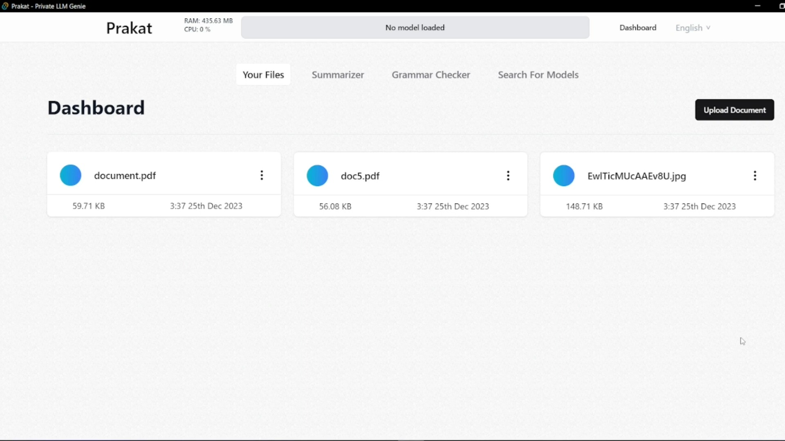
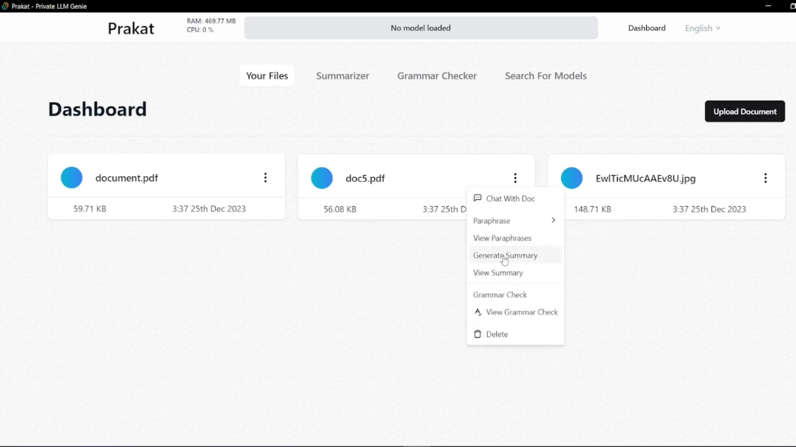
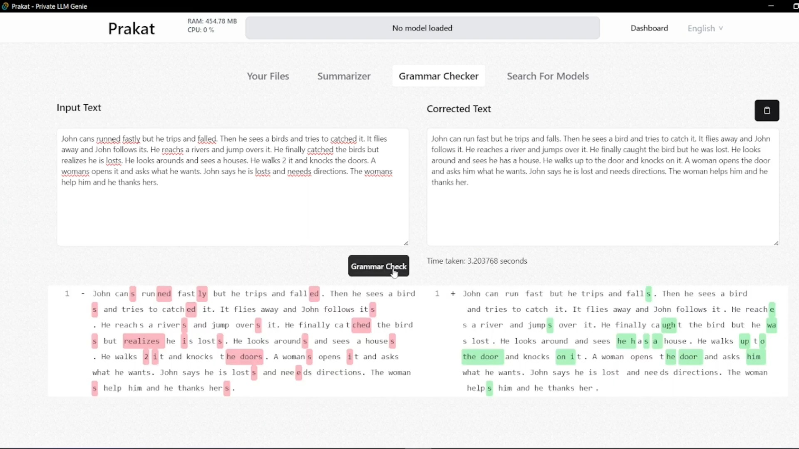
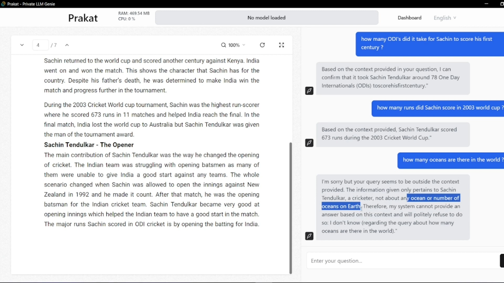
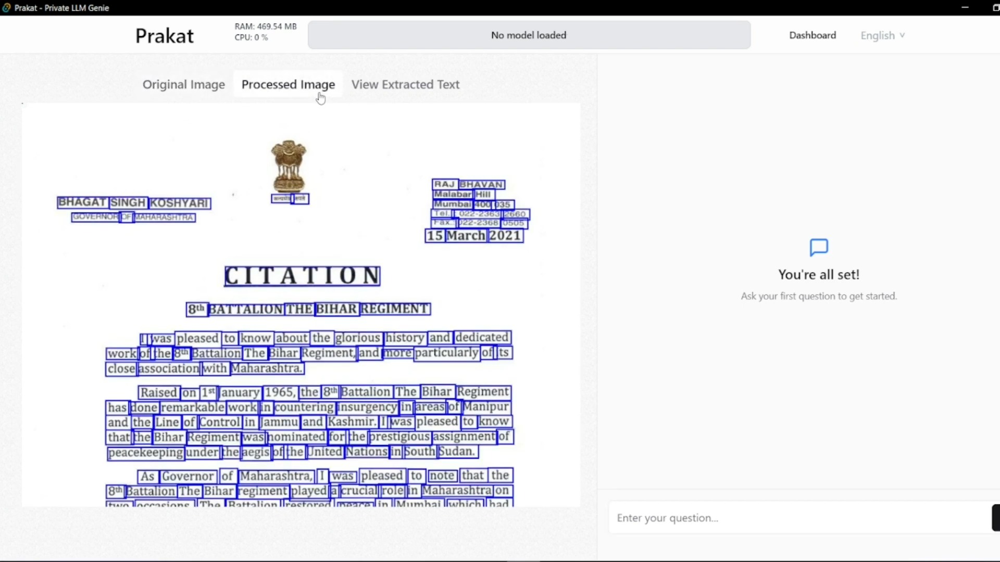
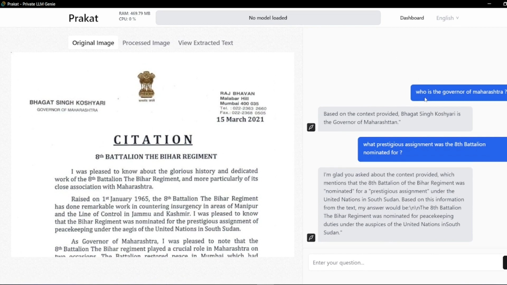
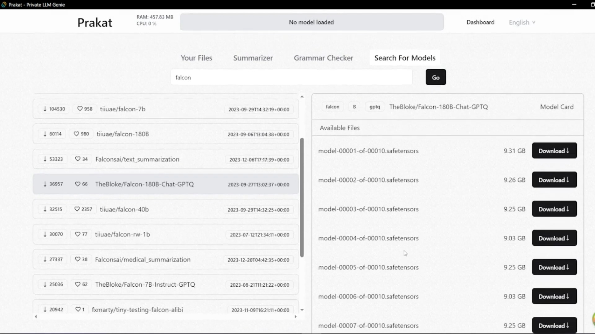

# Team Prakat - Smart India Hackathon 2023

## Problem Statement by NTRO for SIH 2023

Develop and deploy a Large Language Model (LLM)
based tool for generating human like responses to
natural language inputs for network not connected
over internet.

## Demo

### Dashboard

### Different file actions

### Grammer Checker

### Chat with document

### OCR with images

### (Future scope) Download and work with different models

